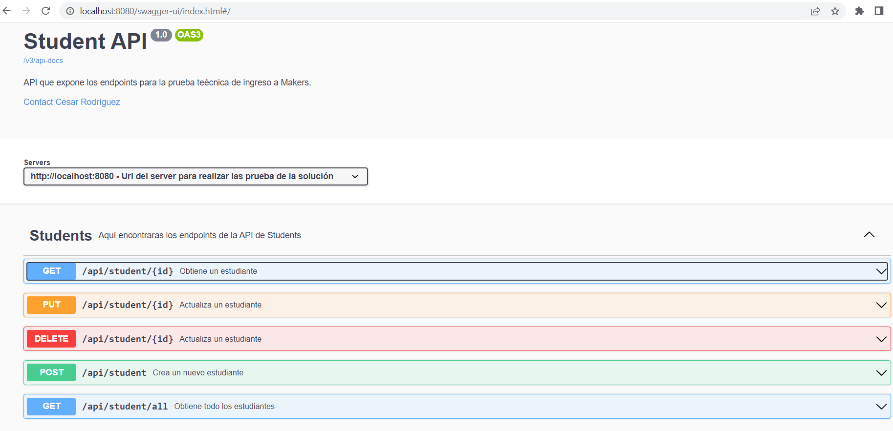
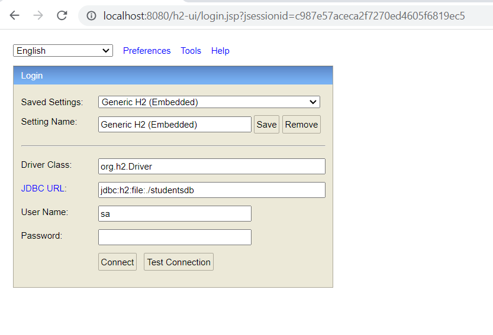
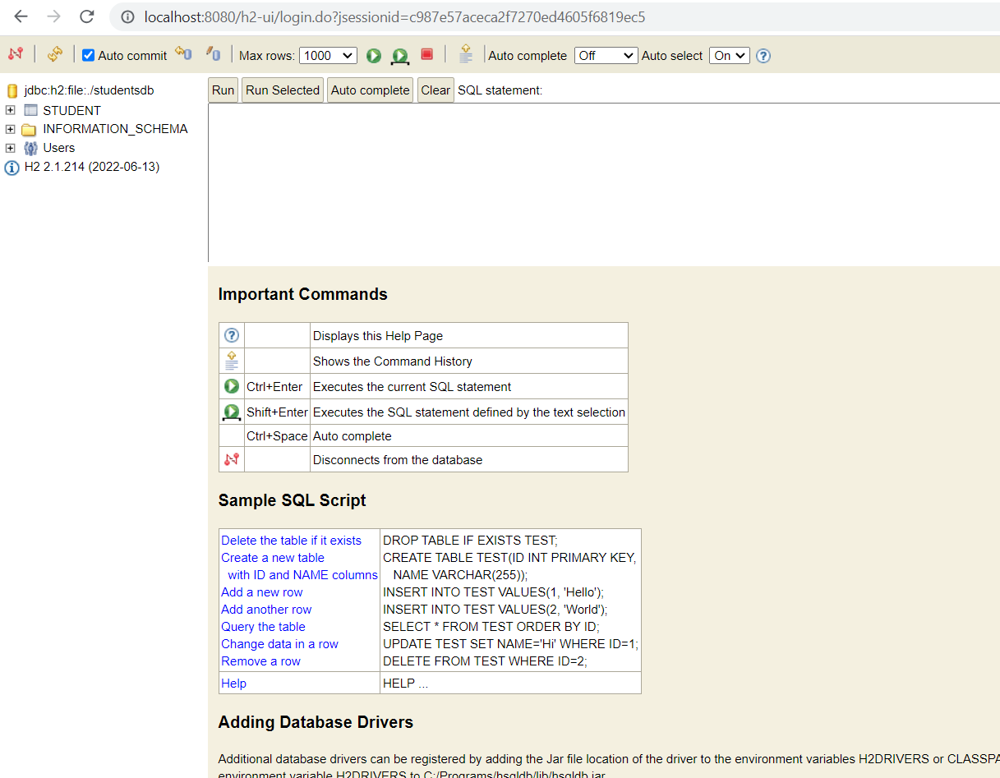
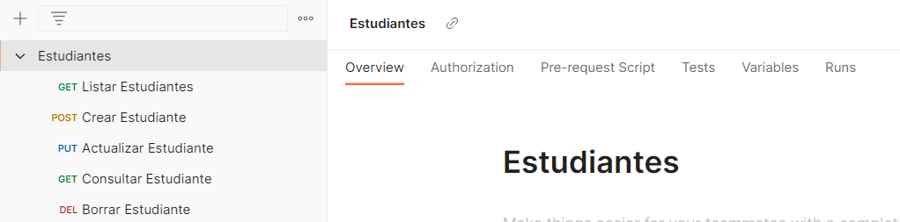

# Prueba Técnica (README)

El repositorio contiene la solución del Backend a la prueba técnica enviada.

## Table de Contenidos

- [Inicio](#Inicio)
    - [Por Consola](#Por-Consola)
    - [Desde un IDE](#Desde-un-IDE)
- [Componentes](#Componentes)
- [Base de Datos](#Base-de-Datos)
    - [Tablas](#Tablas)
    - [Consola H2](#Consola-H2)
- [Postman](#Postman)

## Inicio

Este es el repositorio del backend, para acceder al repositorio del front-end, debes de ir a la siguiente URL [https://github.com/ceauro/makers-react](https://github.com/ceauro/makers-react).

### Por Consola

- Como prerequisito se debe tener instalado mvn y una version de Java 8+

1. Descargar el repositorio en una carpeta local.
2. Abrir una terminal/consola y navegar hasta la carpeta local y una vez allí posicionarse en donde se encuentre el archivo pom.xml
3. Construir el proyecto usando el siguiente comando Maven:
````
mvn clean install
````
4. Una vez la construcción del proyecto haya terminado, se debe ejecutar el siguiente comando java:
````
java -jar target/app-name.jar
````
5. La aplicación SpringBoot debería de iniciar, por lo que debería de ver el log de inicialización en la terminal.
6. Una vez inicie la aplicación de SpringBoot, utilizando postman, curl o cualquier herramienta que permita realizar llamados http, se puede empezar a realizar la prueba de los llamados de la api.

### Desde un IDE
Para ejecutar el proyecto desde un Entorno de Desarrollo Integrado (IDE), se pueden seguir los pasos generales. Los pasos pueden variar ligeramente según el IDE que estés utilizando (por ejemplo, Eclipse, IntelliJ IDEA o Visual Studio Code), pero el proceso general es similar:
1. Abre tu IDE e importa el proyecto Maven: como el proyecto es maven, la mayoría de los IDE reconocerán automáticamente que es un proyecto Maven. Por lo general, se puede importar el proyecto seleccionando "Importar" o "Abrir Proyecto" en el menú del IDE y luego navegando hasta el directorio raíz de tu proyecto donde se encuentra el archivo pom.xml.
2. Una vez que el proyecto esté importado, el IDE descargará y resolverá automáticamente las dependencias de Maven declaradas en el archivo pom.xml. Este proceso asegura que todas las bibliotecas y dependencias necesarias estén disponibles para que el proyecto se pueda construir y ejecutar.
3. Para construir el proyecto, puedes usar el soporte integrado de Maven en el IDE. La mayoría de los IDEs tienen soporte integrado de Maven, lo que te permite construir el proyecto con unos pocos clics. Busca opciones como "Construir Proyecto," "Ejecutar Build de Maven," o opciones similares para iniciar el proceso de construcción.
4. Una vez que el proyecto se haya construido correctamente, puedes ejecutar la aplicación Spring Boot directamente desde el IDE. En la mayoría de los IDEs, puedes hacer clic derecho en la clase principal (la que está anotada con @SpringBootApplication) y seleccionar "Ejecutar" o "Run As" -> "Java Application" o "Spring Boot App." Alternativamente, algunos IDEs pueden proporcionar botones dedicados o accesos directos para ejecutar aplicaciones Spring Boot.
5. Después de que la aplicación comience a ejecutarse, puedes acceder a ella mediante postman, curl o cualquier cliente que te permita hacer llamados http. La URL base es ``http://localhost:8080``

## Componentes

El proyecto fue creado utilizando SpringBoot 3.0.8 y contiene los siguientes elementos:
+ Spring Data: utilizado para realizar los CRUD en la base de datos.
+ H2: motor de base de datos, utilizado para el almacenamiento de los datos.
+ Lombok: utilizado para reducir el codigo boilerplate y mejorar la legibilidad del código
+ ModelMapper: utilizado para hacer mapeos entre clases, de una manera más sencilla.
+ SpringDoc: utilizado para la creación de la documentación en Swagger

## Documentación SWAGGER
Para ingresar a la documentación generada por swagger, se debe tener el proyecto corriendo es ingresar a la siguiente URL ``http://localhost:8080/swagger-ui.html`` utilizando un browser, se deberia ver la siguiente imagen:


## Base de Datos
Al subir el proyecto, la base de datos con la tabla se crea automáticamente.
### Tabla
* Student: en esta tabla se persisten los datos de los estudiantes.

### Consola H2
El proyecto tiene activada la consola de H2 para realizar operaciones sobre la base de datos. Para ingresar a ella, se debe de tener el proyecto corriendo y en un browser ingresar la URL: ``http://localhost:8080/h2-ui``. Debe de aparecer una pantalla como la siguiente:



Los datos que deben de ir son los siguientes:
* Driver Class: org.h2.Driver
* JDBC URL: jdbc:h2:file:./studentsdb
* User Name: sa
* Password: dejar el campo vacío.

Una vez se coloquen los datos correctos, se debe poder ingresar a la consola de H2 que tendrá una vista como la siguiente:


Allí se pueden hacer las operaciones que se deseen sobre la BD.

## Postman
Cree un proyecto postman desde donde se pueden hacer los llamados a los edpoints de la solución.
La url del proyecto es ``https://api.postman.com/collections/1294860-866e3b14-f973-4c98-b64c-726ae5da4580?access_key=PMAT-01H6A2W89PKZQ73NH2MKFHHBXQ``. Con ésta URL deben importar el proyecto en Postman y allí les aparecerá los llamados.
